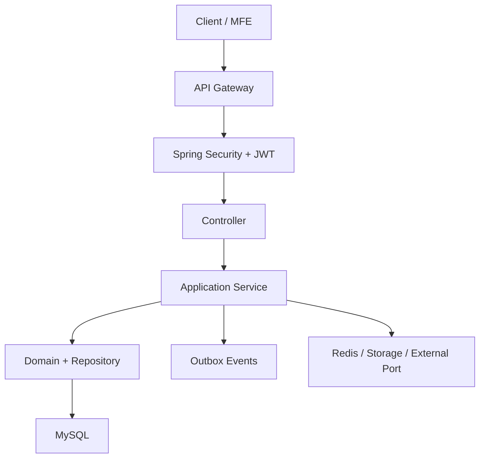
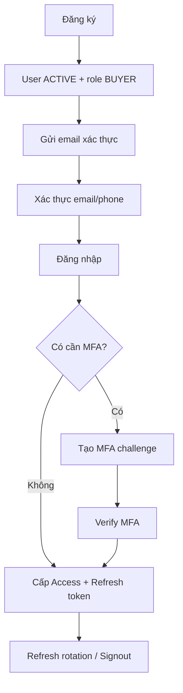
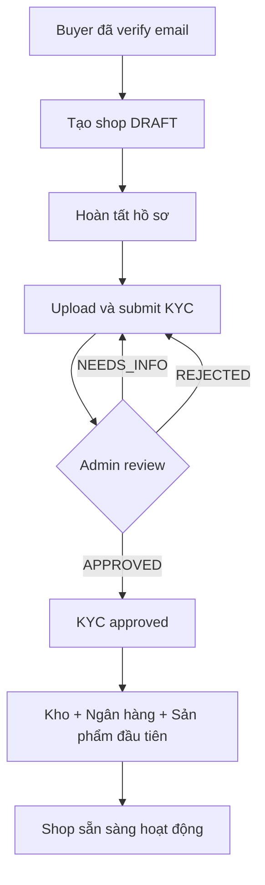

# Phân tích nghiệp vụ và API — Ecommerce TACA User Service

## 1. Phạm vi phân tích

- Repository: [ecommerce-taca/user-service](https://github.com/ecommerce-taca/user-service)
- Nhánh phân tích: [`develop`](https://github.com/ecommerce-taca/user-service/tree/develop)
- Commit tham chiếu: `b66a8af` — ngày 13/09/2026
- Tài liệu đối chiếu: `auth-user-api(2).md`

Kết luận nhanh:

- Repo đã có controller cho đủ **45 endpoint** trong tài liệu.
- Nghiệp vụ cốt lõi đã được triển khai khá đầy đủ: đăng ký, đăng nhập, token rotation, MFA, profile, địa chỉ, seller onboarding, KYC, RBAC, favorite và follow.
- Tuy nhiên service **chưa sẵn sàng production end-to-end** vì vẫn còn adapter mock, chưa có outbox publisher và một số điểm code chưa khớp API contract.

## 2. Phạm vi nghiệp vụ của service

Mặc dù repo tên `user-service`, phạm vi thực tế rộng hơn một User Service thông thường:

| Nhóm nghiệp vụ | Trách nhiệm |
|---|---|
| Identity & Authentication | Đăng ký, đăng nhập, JWT, refresh token, signout, reset password |
| Verification & MFA | Xác thực email, phone OTP, TOTP, recovery code, step-up authentication |
| User Profile | Hồ sơ người dùng, ngày sinh, số điện thoại |
| Address Book | Quản lý địa chỉ giao hàng |
| Seller Management | Tạo shop, seller onboarding, thông tin kho và ngân hàng |
| KYC | Upload hồ sơ, submit, admin review |
| RBAC & Administration | Role, permission, suspend/restore user, audit log |
| Engagement | Favorite sản phẩm, follow shop |
| Public Shop Identity | Thông tin công khai cơ bản của shop |

Service không quản lý nội dung sản phẩm, giá, tồn kho, rating, số lượng sản phẩm, đơn hàng hoặc thanh toán.

## 3. Luồng kỹ thuật chung

Các điểm đáng chú ý:

- JWT dùng RS256, access token 15 phút, refresh token 30 ngày.
- Refresh token chỉ lưu dạng hash.
- Protected request không chỉ kiểm JWT mà còn kiểm `session_id` còn refresh-token family hoạt động trong database qua [`AccessSessionTokenValidator`](https://github.com/ecommerce-taca/user-service/blob/develop/src/main/java/com/ecommerce/authuser/auth/security/AccessSessionTokenValidator.java).
- Các mutation quan trọng ghi audit và tạo outbox event cùng transaction.
- API Gateway và service đều có thể xác thực public key thông qua JWKS.

## 4. Luồng đăng ký, đăng nhập và phiên làm việc

### API Auth — 1 đến 12

| # | API | Chức năng và luồng chính |
|---:|---|---|
| 1 | `POST /auth/signup` | Tạo user `ACTIVE`, gán role `BUYER`, hash password, tạo token xác thực email, refresh-token family và access token. Đồng thời lưu `user.created` và notification command vào outbox. |
| 2 | `POST /auth/signin` | Đăng nhập bằng email/phone. Kiểm tra trạng thái user, password và số lần đăng nhập sai. Sai 5 lần sẽ khóa tạm 15 phút. Admin có MFA đã bật sẽ nhận challenge thay vì token. |
| 3 | `POST /auth/refresh` | Thực hiện refresh-token rotation: token cũ bị đánh dấu `ROTATED`, token mới được cấp trong cùng family. Nếu token cũ bị dùng lại, toàn bộ family bị revoke và ghi audit. |
| 4 | `POST /auth/signout` | Mặc định revoke toàn bộ refresh token trong session hiện tại. Nếu `all_sessions=true`, revoke tất cả refresh token và step-up token của user, đồng thời ghi audit. |
| 5 | `POST /auth/email/verify` | Kiểm tra opaque token, thời hạn và trạng thái sử dụng; đánh dấu email đã xác thực và phát `user.email_verified`. |
| 6 | `POST /auth/email/resend` | Revoke token email cũ, phát hành token mới, tạo notification outbox và audit. Giới hạn tối đa 3 lần/giờ/user. |
| 7 | `POST /auth/phone/request-otp` | Kiểm tra phone E.164, unique và rate limit; revoke OTP challenge cũ, tạo challenge mới và gửi OTP thông qua outbox. Không trả OTP raw. |
| 8 | `POST /auth/phone/verify-otp` | Xác nhận OTP đúng user/challenge. Sai tối đa 5 lần; thành công cập nhật phone và `phone_verified_at`. |
| 9 | `POST /auth/password/forgot` | Luôn trả `202` để tránh dò tài khoản. Nếu user hợp lệ, tạo reset token 30 phút và notification qua email hoặc SMS. |
| 10 | `POST /auth/password/reset` | Kiểm tra reset token one-time, đổi password bằng hash mới, revoke tất cả session và phát `user.password_changed`. |
| 11 | `POST /auth/2fa/setup` | Chỉ dành cho admin role. Tạo TOTP secret được mã hóa, setup challenge và `otpauth_uri`. Chưa bật MFA cho tới khi verify. |
| 12 | `POST /auth/2fa/verify` | Endpoint dùng chung cho ba mục đích: `ENROLL` bật MFA và trả recovery codes; `LOGIN` hoàn tất đăng nhập; `STEP_UP` cấp token xác thực tăng cường cho admin mutation. |

## 5. Luồng hồ sơ và địa chỉ buyer

### API User/Profile/Address — 13 đến 18

| # | API | Chức năng và quy tắc |
|---:|---|---|
| 13 | `GET /users/me` | Lấy profile của JWT subject, danh sách role và shop mặc định. Không cho client truyền user ID. |
| 14 | `PUT /users/me` | Cập nhật tên, phone và ngày sinh. Đổi phone sẽ xóa trạng thái verified và buộc chạy lại OTP. Nếu có thay đổi, phát `user.updated`. |
| 15 | `GET /users/me/addresses` | Lấy danh sách địa chỉ chưa bị xóa, hỗ trợ page/size và sort theo `created_at`. |
| 16 | `POST /users/me/addresses` | Tạo địa chỉ mới, tối đa 20 địa chỉ. Địa chỉ đầu tiên tự động là mặc định; chọn default mới sẽ bỏ default cũ. |
| 17 | `PUT /users/me/addresses/{addressId}` | Chỉ sửa địa chỉ thuộc JWT subject. Việc thay đổi default được thực hiện trong cùng transaction để duy trì đúng một địa chỉ mặc định. |
| 18 | `DELETE /users/me/addresses/{addressId}` | Soft delete. Nếu xóa địa chỉ mặc định, chọn địa chỉ còn lại mới cập nhật nhất làm default. Không cho xóa địa chỉ cuối cùng. |

Địa chỉ chỉ là address book. Khi tạo order, Order Service phải lưu `address_snapshot`; thay đổi hoặc xóa địa chỉ sau đó không được làm thay đổi đơn hàng cũ.

## 6. Luồng seller onboarding và KYC

Luồng dự kiến của `current_step`:

`PROFILE → KYC → WAREHOUSE → BANK → FIRST_PRODUCT → COMPLETED`

Các bước warehouse hoặc bank có thể được gọi sớm; service vẫn lưu trạng thái hoàn thành nhưng chỉ di chuyển `current_step` khi đến đúng bước.

### API Seller — 19 đến 28

| # | API | Chức năng và quy tắc |
|---:|---|---|
| 19 | `POST /users/register-seller` | Yêu cầu email đã xác thực. Tạo một shop `DRAFT`, KYC `DRAFT`, seller onboarding và role `SELLER` scoped theo shop. Kiểm tra unique tax code/slug và một owner chỉ có một shop. |
| 20 | `GET /seller/onboarding` | Trả tiến độ từng bước, `current_step`, shop/KYC status và blockers. Chỉ seller owner được xem. |
| 21 | `PUT /seller/onboarding/profile` | Cập nhật hồ sơ pháp lý/cơ bản của shop và hoàn tất bước `PROFILE`. Chỉ được sửa khi shop còn `DRAFT`. |
| 22 | `PUT /seller/onboarding/warehouse` | Lưu snapshot kho, liên hệ, địa chỉ, hãng vận chuyển và thiết lập COD; đánh dấu bước warehouse hoàn thành. |
| 23 | `POST /seller/onboarding/kyc/documents/presign` | Tạo document record và signed upload URL. Kiểm tra loại file, SHA-256, kích thước tối đa 10 MiB, tối đa 10 file/case và trạng thái KYC. |
| 24 | `POST /seller/onboarding/kyc/documents/complete` | Đối chiếu object key, size, content type và checksum với storage metadata; sau đó chuyển document từ `UPLOADING` sang `UPLOADED`. |
| 25 | `POST /seller/onboarding/kyc/submit` | Yêu cầu email verified, profile đã hoàn thành, có document hợp lệ và không còn upload dở. Chuyển case/shop KYC sang `PENDING`, tiến onboarding sang bước tiếp theo và tạo outbox event. |
| 26 | `PUT /seller/onboarding/bank` | Kiểm tra bank catalog, mã hóa số tài khoản, chỉ lưu last-4 để hiển thị; đánh dấu bước bank hoàn thành. Chưa xác nhận chủ tài khoản thật sự ở phiên bản hiện tại. |
| 27 | `GET /seller/shop` | Seller owner hoặc staff đọc shop; tax code và bank account được mask. Trả thêm warehouse/bank summary. |
| 28 | `PUT /seller/shop` | Seller owner cập nhật tên, mô tả và logo. Không cho thay owner, tax code, trạng thái hoặc slug qua implementation hiện tại. |

## 7. Luồng quản trị, KYC và RBAC

### API Admin/Internal — 29 đến 36

| # | API | Chức năng và quy tắc |
|---:|---|---|
| 29 | `GET /admin/shops/kyc` | Danh sách KYC queue theo status, từ khóa, pagination và sort. Yêu cầu permission `KYC_READ`. |
| 30 | `GET /admin/shops/{shopId}/kyc` | Chi tiết case, shop và document metadata. Tạo signed download URL 10 phút cho tài liệu đã upload. |
| 31 | `POST /admin/shops/{shopId}/kyc/review` | `RISK_MANAGER`/`SUPER_ADMIN` có `KYC_DECIDE` thực hiện `APPROVED`, `NEEDS_INFO` hoặc `REJECTED`. Cập nhật case/shop, ghi audit và tạo `shop.kyc.*` event. `REJECTED` yêu cầu step-up MFA. |
| 32 | `GET /admin/users/{userId}/roles` | Đọc các role assignment, scope shop/system và permission được suy ra từ role. Yêu cầu `ROLE_READ` hoặc super admin. |
| 33 | `PATCH /admin/users/{userId}/roles` | Grant/revoke role. Luôn yêu cầu `ROLE_ASSIGN` và step-up token; cấm tự cấp role, kiểm tra role hierarchy và shop scope; ghi audit và `user.role_changed`. |
| 34 | `PATCH /admin/users/{userId}/status` | Suspend hoặc restore user. Cấm admin tự suspend; yêu cầu `USER_SUSPEND` và MFA step-up. Suspend sẽ revoke toàn bộ refresh token, ghi Redis revoked-user, audit và `user.status_changed`. |
| 35 | `GET /admin/audit-logs` | Tra cứu audit theo actor, target, action và thời gian. Khoảng thời gian tối đa 31 ngày; metadata nhạy cảm được mask; loại log nhìn thấy phụ thuộc permission. |
| 36 | `GET /.well-known/jwks.json` | Công bố public RSA key hiện tại và key cũ trong thời gian rotation để Gateway/internal services xác minh JWT. Không bao giờ trả private key. |

## 8. Favorite, follow và public shop

### API Favorite — 37 đến 40

| # | API | Chức năng và quy tắc |
|---:|---|---|
| 37 | `GET /users/me/favorites` | Danh sách reference `product_id`, tối đa theo pagination. Chi tiết sản phẩm phải hydrate từ Product Catalog/BFF. |
| 38 | `POST /users/me/favorites` | Thêm favorite, idempotent: mới trả `201`, đã tồn tại trả `200`. Tối đa 500 sản phẩm/user; không kiểm tra product tồn tại. |
| 39 | `DELETE /users/me/favorites/{productId}` | Xóa favorite, idempotent; không tồn tại vẫn trả `204`. |
| 40 | `GET /users/me/favorites/contains` | Kiểm tra trạng thái favorite theo batch, tối đa 100 product ID/request. |

### API Follow/Public shop — 41 đến 45

| # | API | Chức năng và quy tắc |
|---:|---|---|
| 41 | `POST /shops/{shopId}/follow` | Theo dõi shop, idempotent; tối đa 1.000 shop/user. Code chỉ từ chối shop `DELETED`. |
| 42 | `DELETE /shops/{shopId}/follow` | Bỏ theo dõi, idempotent; không tồn tại vẫn `204`. |
| 43 | `GET /users/me/following` | Danh sách shop đã follow, ghép thông tin name/slug/logo từ bảng shop local. |
| 44 | `GET /shops/{shopId}/followers/count` | Public API trả số follower của shop. Code hiện đếm trực tiếp từ database. |
| 45 | `GET /shops/{shopId}` | Public shop profile: name, slug, logo, description, verified status và follower count; không trả dữ liệu pháp lý/ngân hàng/owner. |

## 9. Những điểm chưa khớp giữa tài liệu và code

Đây là các điểm nên xử lý trước khi coi API contract là hoàn thành.

| Mức độ | Vấn đề | Hiện trạng |
|---|---|---|
| Cao | Đăng nhập bằng phone chưa verified | [`SigninService`](https://github.com/ecommerce-taca/user-service/blob/develop/src/main/java/com/ecommerce/authuser/auth/application/signin/SigninService.java) tìm user theo phone nhưng không kiểm tra `phoneVerifiedAt`. |
| Cao | Admin chưa bật MFA vẫn đăng nhập thẳng | Code chỉ tạo MFA challenge khi credential đã `ENABLED` hoặc `RESET_REQUIRED`; admin chưa enroll MFA vẫn được cấp token. |
| Cao | Chưa có outbox publisher | Repo lưu `outbox_events` nhưng không có relay/scheduler/Kafka producer để publish. Notification và downstream event mới dừng ở database. |
| Cao | Adapter production còn thiếu | KYC storage, bank catalog và bank encryption đều là `@Profile("!prod")` mock/local adapter. Với profile `prod`, repo chưa có implementation thay thế. |
| Cao | Public shop không hỗ trợ slug | Tài liệu cho phép UUID hoặc slug, nhưng [`GetPublicShopController`](https://github.com/ecommerce-taca/user-service/blob/develop/src/main/java/com/ecommerce/authuser/shop/web/publicprofile/GetPublicShopController.java) bắt buộc parse canonical UUID. |
| Trung bình | Signout tất cả session của buyer khó thực hiện | `all_sessions=true` chỉ hỗ trợ MFA step-up. Buyer không được dùng `/2fa/setup`, nên không có luồng re-auth bằng password như contract gợi ý. |
| Trung bình | Email resend chưa hỗ trợ recovery token | Code yêu cầu JWT authenticated; nhánh “authenticated hoặc recovery token” trong danh sách API chưa được triển khai. |
| Trung bình | Shop DRAFT/SUSPENDED vẫn public và followable | Public profile/follow chỉ loại `DELETED`; cần xác nhận có nên chỉ cho `ACTIVE`. |
| Trung bình | Chưa có luồng hoàn tất `FIRST_PRODUCT` và activate shop | KYC approval chỉ đổi `kyc_status`; không đổi `shop.status` sang `ACTIVE`. Repo cũng chưa có consumer/API hoàn tất sản phẩm đầu tiên. |
| Trung bình | Restore user chưa xóa Redis revoke key | User vừa restore có thể vẫn bị Gateway chặn tối đa 15 phút, vì code chỉ set key khi suspend mà không clear khi restore. |
| Thấp | Follower count contract ghi eventual | Implementation hiện tại query count trực tiếp từ bảng follow, chưa phải cached/eventual count. |
| Thấp | Register seller response mẫu có blocker không hợp lý | Endpoint bắt buộc email verified nhưng response mẫu vẫn có `EMAIL_VERIFICATION_REQUIRED`; code tạo onboarding với blocker rỗng. |
| Phụ thuộc Gateway | Rate limit | Tài liệu quy định nhiều mức rate limit nhưng repo không có rate limiter; cần chắc chắn API Gateway chịu trách nhiệm. |

## 10. Kết luận

Về mặt nghiệp vụ, service được tổ chức khá rõ theo từng feature và đã bao phủ toàn bộ API contract. Các phần mạnh nhất là:

- Refresh-token rotation và phát hiện reuse.
- Account lock, audit login và chống account enumeration.
- MFA enrollment/login/step-up.
- Ownership và scope trong address, seller, KYC, RBAC.
- Transactional outbox cho các thay đổi quan trọng.
- Mã hóa/masking dữ liệu nhạy cảm.

Nhưng trạng thái hiện tại nên được hiểu là:

> **Đã hoàn thiện phần lớn domain và HTTP API, nhưng chưa hoàn thiện tích hợp production.**

Ưu tiên sửa nên là: kiểm tra phone verified khi signin → bắt buộc MFA cho admin → bổ sung production adapters → triển khai outbox relay → đồng bộ lại contract UUID/slug và luồng activate shop.
